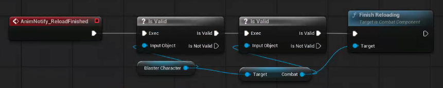
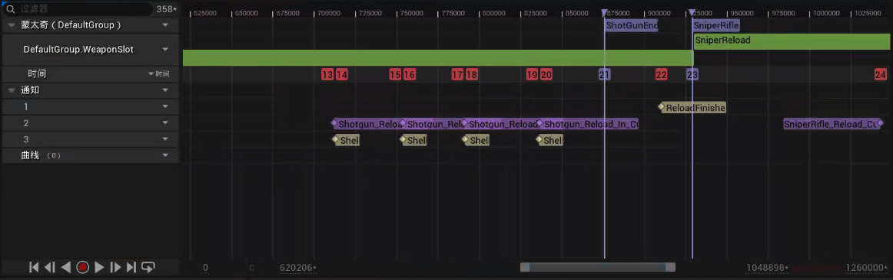
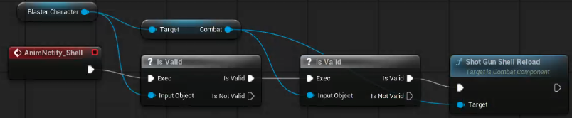

# Unreal Engine 5 C++ Multiplayer Shooter

[toc]

## 知识

### C++事件与委托

https://blog.csdn.net/m0_73800387/article/details/145742459

## 创建项目

### Project Creation

**Plugin因为版本产生的问题**

1. `OnLevelRemovedFromWorld`不再被使用

   ```c++
   // virtual void OnLevelRemovedFromWorld(ULevel* InLevel, UWorld* InWorld);
   virtual void NativeDestruct() override;

   /*void UMenu::OnLevelRemovedFromWorld(ULevel* InLevel, UWorld* InWorld)
   {
       MenuTearDown();
       Super::OnLevelRemovedFromWorld(InLevel, InWorld);
   }*/
   void UMenu::NativeDestruct()
   {
       MenuTearDown();
       Super::NativeDestruct();
   }
   ```
2. `SEARCH_PRESENCE`找不到

   ```c++
   #include "Online/OnlineSessionNames.h"
   ```

### Test an Online Session

### Assets

### Retargeting Animations

### Blaster Character

### Camera and Sping Arm

### Character Movement

**轴和操作映射已经被废弃，在5.1版本之后需要使用增强输入**

```c++
 // Called when the game starts or when spawned
 void ABlasterCharacter::BeginPlay()
 {
 	Super::BeginPlay();
 
 	if (APlayerController* PlayerController = Cast<APlayerController>(GetController()))
 	{
 		if (ULocalPlayer* LocalPlayer = PlayerController->GetLocalPlayer())
 		{
 			if (UEnhancedInputLocalPlayerSubsystem* InputSystem = ULocalPlayer::GetSubsystem<UEnhancedInputLocalPlayerSubsystem>(LocalPlayer))
 			{
 				if (BlasterMapping)
 				{
 					InputSystem->AddMappingContext(BlasterMapping, 0);
 				}
 			}
 		}
 	}
 
 }
 
 void ABlasterCharacter::Move(const FInputActionValue& Value)
 {
     FVector2D MoveVector = Value.Get<FVector2D>();
     if (Controller)
     {
         const FRotator Rotation = Controller->GetControlRotation();
         // only get the yaw rotation
         const FRotator YawRotation(0, Rotation.Yaw, 0);
         const FVector ForwardDirection = FRotationMatrix(YawRotation).GetUnitAxis(EAxis::X);
 		const FVector RightDirection = FRotationMatrix(YawRotation).GetUnitAxis(EAxis::Y);
 		AddMovementInput(ForwardDirection, MoveVector.X);
 		AddMovementInput(RightDirection, MoveVector.Y);
     }
 }
 
 void ABlasterCharacter::Look(const FInputActionValue& Value)
 {
 	FVector2D LookVector = Value.Get<FVector2D>();
 	if (Controller)
 	{
 		AddControllerYawInput(LookVector.X);
 		AddControllerPitchInput(LookVector.Y);
 	}
 }
 
 void ABlasterCharacter::SetupPlayerInputComponent(UInputComponent* PlayerInputComponent)
 {
 	Super::SetupPlayerInputComponent(PlayerInputComponent);
 
 	if (UEnhancedInputComponent* EnhancedInputComponent = CastChecked<UEnhancedInputComponent>(PlayerInputComponent))
 	{
 		EnhancedInputComponent->BindAction(LookAction, ETriggerEvent::Triggered, this, &ABlasterCharacter::Look);
 		EnhancedInputComponent->BindAction(MoveAction, ETriggerEvent::Triggered, this, &ABlasterCharacter::Move);
 	}
 
 }
```

此外，上述代码中未涉及Jump的实现方式，但其实和Move、Look没有区别。

首先在UE中创建input action，然后将其和mapping绑定，随后在C++中使用bindAction绑定，需要注意的是，此处无需实现jump，可以直接使用ACharacter::Jump()作为绑定函数，随后再在UE的Character界面将JumpAction设置为前面创建的Input Action就行了。

## 武器

### FABRIK

[CSDN：UE5学习笔记18-使用FABRIK确定骨骼的左手位置](https://blog.csdn.net/m0_53219246/article/details/141572338)

**IK Bone 指定的是控制目标，而不是目标手**

在 Unreal Engine 5（UE5）中，IK Bone 并不一定是被控制的那只手，而是 IK 计算的参考点，即最终需要对齐的目标位置。因此，在某些情况下，左手的 IK 可能使用 hand_r 作为 IK Bone，而右手的 IK 可能使用 hand_l 作为 IK Bone。

在 IK 计算中，我们需要：

1. **要被 IK 控制的骨骼（Controlled Bone）** → 例如 hand_l（左手）。
2. **IK Bone（控制目标）** → 目标点，例如 hand_r（右手），表示左手要对齐到它的位置。

**误解**：很多人认为 IK Bone 直接指代被控制的手，但实际上 IK Bone 是一个计算目标，不是一定绑定到被控制的手。

> 场景 ：双手握枪（左手 IK 使用 hand_r）
>
> **问题**：左手需要跟随右手（主手）的位置。
>
> 右手 hand_r 主要控制枪的位置；左手 hand_l 需要靠近枪，但不能完全自由运动，否则枪会飘。
>
> **IK 目标（Target）** 应该是 **右手** hand_r**，因为左手要追随它**。
>
> **正确设置**：Controlled Bone：hand_l（左手）；IK Bone（目标）：hand_r（右手）。
>
> **IK 计算**：调整左手，使其靠近右手，让左手固定在枪支上。
>
> 左手 (hand_l) → IK Bone 指向 hand_r → 让左手对齐到右手的位置
>
> **效果**：角色左手始终握住枪，不会与右手脱离。

### Turning In Place

### Rotate Root Bone

在 Unreal Engine (UE) 中，`FMath::FInterpTo()` 是一个用于线性插值（Linear Interpolation, Lerp）的函数，通常用于平滑过渡数值，例如对象的位置、旋转或缩放等。它的基本作用是让一个值以一定速度逐步逼近目标值，适用于平滑运动或数值变化。

```c++
static float FInterpTo(
    float Current,    // 当前值
    float Target,     // 目标值
    float DeltaTime,  // 每帧的时间增量
    float InterpSpeed // 插值速度
);
```

- `Current`：当前数值，即需要插值的初始值。
- `Target`：目标数值，即最终想要达到的值。
- `DeltaTime`：帧间隔时间（通常为 `GetWorld()->GetDeltaSeconds()`）。
- `InterpSpeed`：插值速度，值越大，变化越快。

返回一个新的 `float` 值，该值向 `Target` 方向移动，并受到 `InterpSpeed` 控制。

### Net Update Frequency

```c++
// in BalsterCharacter.cpp BlasterCharacter::BlasterCharacter()
NetUpdateFrequency = 66.f;
MinNetUodateFrequency = 33.f;
```

在 `AActor` 类中，有以下两个属性控制网络更新频率：

1. **NetUpdateFrequency**

```c++
float NetUpdateFrequency;
```

- **作用**：设置 **每秒更新次数**（Tick 之间的最小间隔）。
- **默认值**：**100 次/秒**
- **影响**：值越大，Actor 在客户端上的位置、状态更新得越频繁，但会增加网络带宽消耗。

2. **MinNetUpdateFrequency**

```c++
float MinNetUpdateFrequency;
```

- **作用**：定义 **最小更新频率**，用于优化性能。
- **默认值**：**2 次/秒**
- **影响**：如果服务器检测到 Actor 没有发生变化，它可能会减少更新频率以节省带宽。

### Footstep and Jump Sounds

在Unreal Engine中，**多播RPC（Multicast RPC）** 是一种网络通信机制，用于在多人游戏中**由服务器触发一个事件，并同步到所有连接的客户端**（包括服务器自身）。它是实现游戏逻辑和效果（如声音、粒子、动画）跨网络同步的核心工具之一。

#### 多播RPC的核心特点

1. **触发方式**• **仅在服务器调用**：多播RPC必须由服务器（Authority）发起，客户端无法直接调用。
   • **广播执行**：服务器调用后，所有客户端（包括服务器自己）会执行绑定的函数。
2. **同步行为**• **逻辑一致性**：确保所有客户端在同一时间执行相同的操作（如播放爆炸音效）。
   • **依赖网络延迟**：客户端收到指令后立即执行，但实际执行时间受网络延迟影响。
3. **可靠性与不可靠性**
   • **Reliable（可靠）**：保证事件最终会被所有客户端接收（适用于关键操作，如角色死亡音效）。
   • **Unreliable（不可靠）**：允许事件丢失（适用于高频低优先级操作，如脚步声）。

#### 多播RPC的底层原理

1. **服务器触发**• 服务器调用多播RPC函数，将事件数据打包并发送给所有客户端。
2. **网络传输**• 通过UDP协议传输（默认），若标记为Reliable，则使用可靠传输通道。
3. **客户端执行**
   • 客户端收到数据后，解析并执行绑定的函数逻辑（如播放声音）。

#### 多播RPC与其他RPC的区别

| **RPC类型**       | **触发端**     | **执行端**        | **典型场景**               |
| ----------------------- | -------------------- | ----------------------- | -------------------------------- |
| **Server RPC**    | 客户端 → 服务器     | 仅在服务器执行          | 玩家输入（如射击、跳跃）         |
| **Client RPC**    | 服务器 → 客户端     | 仅在指定客户端执行      | 更新玩家UI、私聊消息             |
| **Multicast RPC** | 服务器 → 所有客户端 | 所有客户端 + 服务器执行 | 同步全局事件（如爆炸、天气变化） |

#### 在蓝图中使用多播RPC（以播放声音为例）

步骤一：定义多播RPC函数

1. 在角色或Actor蓝图中，右键添加自定义事件。
2. 在事件详情中设置 **Replicates** → **Multicast**，并选择可靠性（Reliable/Unreliable）。
   

步骤二：服务器触发多播

```cpp
// 在角色蓝图中（示例为C++代码，蓝图逻辑类似）
void AMyCharacter::PlayExplosionSound()
{
    if (HasAuthority()) // 确保在服务器执行
    {
        Multicast_PlayExplosionSound();
    }
}

UFUNCTION(NetMulticast, Reliable)  
void AMyCharacter::Multicast_PlayExplosionSound()
{
    UGameplayStatics::PlaySoundAtLocation(this, ExplosionSound, GetActorLocation());
}
```

步骤三：客户端响应

• 所有客户端（包括服务器）会自动执行 `Multicast_PlayExplosionSound()`，播放爆炸声。

---

#### 多播RPC的适用场景

1. **全局事件同步**• 爆炸、天气变化、Boss怒吼等需所有玩家感知的效果。
2. **角色动作同步**• 播放角色受击、死亡、技能音效。
3. **物体交互同步**
   • 门开关、宝箱开启等场景互动音效。

---

#### 注意事项与优化

1. **权限检查**• 始终用 `if (HasAuthority())` 保护多播RPC调用，防止客户端误触发。
2. **带宽优化**• 避免高频调用（如每帧触发），优先使用客户端本地预测 + 服务器修正。
   • 对非关键音效使用 **Unreliable** 多播（如脚步声）。
3. **参数传递限制**• 多播RPC的参数需支持网络序列化（如 `FVector`、`int`、`AActor*`），避免传递复杂对象。
4. **延迟补偿**
   • 对时间敏感的操作（如射击命中音效），可在客户端先本地播放，再通过服务器验证。

---

#### 调试多播RPC

1. **Network Profiler**• 使用 `Stat Net` 命令查看RPC调用频率和带宽占用。
2. **Log输出**• 在多播函数内添加 `UE_LOG(LogTemp, Warning, TEXT("Multicast Called!"));`，观察客户端执行情况。
3. **Replay系统**
   • 通过回放功能检查事件是否同步。

#### 总结

多播RPC是Unreal Engine多人游戏开发中实现**“一次触发，全局执行”**的核心机制，尤其适用于需要所有客户端同步视觉效果或音频的场景。合理使用多播RPC，结合其他同步技术（如变量复制、客户端预测），可以在保证体验的同时优化网络性能。

## 射击武器

### Projectile Weapons

#### Hit Scan VS Projectile

```c++
// 生成抛射物Actor
AProjectile* Projectile = GetWorld()->SpawnActor<AProjectile>(ProjectileClass, MuzzleLocation, MuzzleRotation);
Projectile->SetDamage(DamageValue);
Projectile->FireInDirection(ShootDirection);
```

```c++
// 射线检测
FHitResult HitResult;
FCollisionQueryParams Params;
Params.AddIgnoredActor(GetOwner());

if (GetWorld()->LineTraceSingleByChannel(HitResult, MuzzleLocation, TraceEnd, ECC_GameTraceChannel1, Params)) {
    AActor* HitActor = HitResult.GetActor();
    if (HitActor) {
        UGameplayStatics::ApplyDamage(HitActor, DamageValue, GetInstigatorController(), this, UDamageType::StaticClass());
    }
}
```

#### UPROPERTY

|          参数          |                                作用                                |
| :--------------------: | :-----------------------------------------------------------------: |
|    `EditAnywhere`    |       变量可在**蓝图**和**编辑器属性面板**中编辑       |
|  `VisibleAnywhere`  |                    变量在属性面板可见但不可编辑                    |
| `BlueprintReadWrite` |     允许**蓝图**读写该变量（需谨慎使用，可能破坏封装性）     |
| `BlueprintReadOnly` |                 允许**蓝图**读取但不允许修改                 |
|      `Category`      |         在编辑器中将变量归类到特定分组（如`Category="Combat         |
|     `Replicated`     | 变量支持**网络同步**（需在类声明中添加 `replicated`关键字） |
|      `SaveGame`      |                 变量可被序列化保存（用于存档系统）                 |
|     `Transient`     |            变量不会被保存或加载（常用于运行时临时数据）            |

#### Collision

`void UPrimitiveComponent::SetCollisionObjectType(ECollisionChannel Channel);`

是用于动态修改 **Primitive Component（基本组件）** 的 **碰撞对象类型（Collision Object Type）** 的关键函数。以下是其核心用法及注意事项：

**功能**：设置组件的碰撞对象类型（如 `ECC_WorldStatic`、`ECC_Pawn` 等），决定其属于哪个碰撞通道（Collision Channel）。

**适用对象**：所有继承自 `UPrimitiveComponent` 的组件（如 `StaticMeshComponent`、`BoxComponent` 等）。

常见场景：动态改变物体的碰撞类型（如将门从阻挡改为可穿透）。根据游戏逻辑切换物体的交互规则（如武器在拾取后不再阻挡玩家）。

碰撞通道（collision channel）：在 Unreal Engine (UE) 中，碰撞通道（Collision Channel） 是用于管理不同对象之间碰撞检测和响应的系统。它们允许开发者定义哪些对象可以相互碰撞、阻挡或触发重叠事件。通过合理配置碰撞通道，可以优化物理计算性能，并实现复杂的交互逻辑。

UE中的碰撞通道分为两种类型（也可以自定义碰撞通道）：

1. **Object Channels（对象通道）**
   表示对象的“身份”，用于标识特定类型的物体（如角色、子弹、环境等）。
   默认预设的Object Channels包括：WorldStatic：静态场景物体（如地形、静态网格体）。WorldDynamic：动态场景物体（如可移动的Actor、带物理的物体）。Pawn：玩家或AI控制的角色（如玩家角色、NPC）。PhysicsBody：具有物理模拟的物体（如刚体）。Vehicle：载具类物体。Destructible：可破坏的物体。Camera：用于相机的碰撞检测（如避免相机穿墙）。Projectile：子弹、抛射物。OverlapAll_Deprecated：已弃用的旧通道（不建议使用）。
2. **Trace Channels（追踪通道）**
   用于射线检测（Line Trace）、形状检测（Sweep）等查询操作。
   默认预设的Trace Channels包括：Visibility：用于可见性检测（如判断玩家是否被遮挡）。Camera：相机相关的射线检测（如第三人称相机的碰撞避免）。

`void UPrimitiveComponent::SetCollisionEnabled(ECollisionEnabled::Type NewType);`

参数：`ECollisionEnabled::Type` 枚举值，定义碰撞的启用状态。

作用：动态调整组件是否参与 射线检测（Query） 或 物理碰撞（Physics）。

|          枚举值          |                                   说明                                   |
| :-----------------------: | :----------------------------------------------------------------------: |
|   **NoCollision**   |            完全禁用碰撞，既不响应射线检测，也不参与物理碰撞。            |
|    **QueryOnly**    | 仅启用射线检测（如 `LineTrace`），但忽略物理碰撞（物体可以互相穿过）。 |
|   **PhysicsOnly**   |             仅启用物理碰撞（阻挡其他物体），但忽略射线检测。             |
| **QueryAndPhysics** |                 同时启用射线检测和物理碰撞（默认状态）。                 |

**射线检测（Raycast / Line Trace）** 是一种通过模拟一条虚拟射线（直线）来检测场景中物体是否存在碰撞的技术。这种技术通常被称为 **“Query”**（查询），因为它的核心目的是通过射线“查询”场景中的物体信息，而非处理物理碰撞（如物体弹跳、受力等）。在 **Unreal Engine (UE)** 中，射线检测是实现许多关键功能的基础工具。

`void UPrimitiveComponent::SetCollisionResponseToChannel(ECollisionChannel Channel, ECollisionResponse NewResponse);`

`void UPrimitiveComponent::SetCollisionResponseToAllChannels(ECollisionResponse NewResponse);`

|                  函数                  |      作用范围      |                典型场景                |
| :-------------------------------------: | :----------------: | :------------------------------------: |
|   `SetCollisionResponseToChannel()`   | **单个通道** | 精确调整特定通道的响应（如仅针对敌人） |
| `SetCollisionResponseToAllChannels()` | **所有通道** |  批量设置所有通道的响应（如全局忽略）  |

|        枚举值        |                                  说明                                  |
| :-------------------: | :---------------------------------------------------------------------: |
| **ECR_Ignore** |           完全忽略碰撞，不触发任何事件，物体之间可互相穿透。           |
| **ECR_Overlap** | 触发重叠事件（如 `OnBeginOverlap`），但物体不会阻挡彼此（物理穿透）。 |
|  **ECR_Block**  |             阻挡物理移动，并触发碰撞事件（如 `OnHit`）。             |

### Fire Montage

### Fire Weapon Effects

```c++
\\ Weapon.h
AnimationAsset* FireAnimation;
void Fire();

\\ Weapon.cpp
void Fire() {
    PlayAnimation();
}

\\ CombatComponent.cpp
void FireButtonPressed() {
    \\
    EquippedWeapon->Fire();
	\\
}

```

### Weapon Effects in Multiplayer

#### RPC

在 **Unreal Engine (UE)** 中，**RPC（Remote Procedure Call，远程过程调用）** 是实现多玩家网络同步的核心机制，允许客户端与服务器之间或客户端之间相互调用函数，触发远程逻辑的执行。以下是其核心概念、使用场景及实践指南：

##### 1. RPC 的核心作用

- **跨机器执行逻辑**：在分布式游戏架构中，RPC 确保特定函数不仅在本机调用，还能在远程机器（服务器或其他客户端）上执行。
- **事件驱动同步**：适用于一次性动作（如开火、播放音效、触发动画），而非持续状态同步（如角色位置，通常通过属性复制实现）。

##### 2. RPC 的三种类型

UE 支持三类 RPC，通过 `UFUNCTION` 宏的修饰符定义：

|          类型          |      修饰符      |          执行范围          |              典型场景              |
| :---------------------: | :--------------: | :------------------------: | :--------------------------------: |
|  **Server RPC**  |    `Server`    |       仅在服务端执行       | 客户端请求服务端验证操作（如攻击） |
|  **Client RPC**  |    `Client`    |     仅在指定客户端执行     |      服务端通知客户端播放特效      |
| **Multicast RPC** | `NetMulticast` | 服务端调用，所有客户端执行 |     广播全局事件（如游戏开始）     |

附加参数：

- **`Reliable`/`Unreliable`**：定义传输可靠性。可靠RPC确保到达，但延迟高；不可靠RPC可能丢失，但速度快（如 `UFUNCTION(Client, Unreliable)`）。
- **`WithValidation`**：为 Server RPC 添加验证函数，防止作弊（如 `UFUNCTION(Server, WithValidation)`）。

##### 3. RPC 的工作原理

1. **调用端发起**：客户端或服务器调用一个标记为 RPC 的函数。
2. **网络传输**：UE 网络系统将函数调用序列化并通过网络发送。
3. **远程执行**：接收端解析数据并执行对应的函数逻辑。

##### 4. 使用步骤（以 C++ 为例）

(1) 声明 RPC 函数

```cpp
// 声明一个可靠的服务端RPC（带验证）
UFUNCTION(Server, Reliable, WithValidation)
void ServerFireProjectile(FVector Location, FRotator Rotation);

// 对应的客户端RPC（不可靠）
UFUNCTION(Client, Unreliable)
void ClientPlayMuzzleEffect();

// 组播RPC
UFUNCTION(NetMulticast, Reliable)
void MulticastExplodeFX();
```

(2) 实现函数与验证

```cpp
// Server RPC 实现
void AMyCharacter::ServerFireProjectile_Implementation(FVector Location, FRotator Rotation)
{
    // 服务端逻辑：生成抛射体
    if (HasEnoughAmmo()) // 示例验证
    {
        SpawnProjectile(Location, Rotation);
        MulticastExplodeFX(); // 调用组播RPC通知所有客户端
    }
}

// 验证函数（防止恶意调用）
bool AMyCharacter::ServerFireProjectile_Validate(FVector Location, FRotator Rotation)
{
    return IsValidRotation(Rotation); // 自定义校验逻辑
}

// Client RPC 实现
void AMyCharacter::ClientPlayMuzzleEffect_Implementation()
{
    PlayMuzzleFlash(); // 客户端播放枪口特效
}

// Multicast RPC 实现
void AMyCharacter::MulticastExplodeFX_Implementation()
{
    SpawnExplosion(); // 所有客户端生成爆炸特效
}
```

(3) 调用 RPC

```cpp
void AMyCharacter::OnFireButtonPressed()
{
    // 本地播放临时特效（无需等待RPC）
    PlayMuzzleFlash();

    // 调用服务端RPC（触发验证和服务器逻辑）
    ServerFireProjectile(GetGunLocation(), GetAimRotation());
}
```

#### CODE

```c++
// CombatComponent.h
protected:
	UFUNCTION(Server, Reluable)
	void SeverFire();
	UFUNCTION(Multicast, Reluable)
	void MulticastFire();

// CombatComponent.cpp
void ServerFire_Implementation() {
	MulticastFire();
}
void MulticastFire_Implementation() {
    /*
    */
}
```

### The Hit Target

#### 帧同步&状态同步

|    **特性**    |        **状态同步**        |        **帧同步**        |
| :------------------: | :------------------------------: | :----------------------------: |
|  **同步内容**  | 对象属性（位置、血量、动画状态） |          输入和逻辑帧          |
|  **带宽消耗**  |    较高（需持续同步状态变化）    |       较低（仅传输输入）       |
| **实现复杂度** |       低（依赖UE内置机制）       |   高（需保证逻辑完全确定性）   |
|  **适用场景**  |   FPS、MMO、复杂物理交互的游戏   |      MOBA、RTS、格斗游戏      |
| **抗延迟能力** |  客户端预测+插值，容忍中等延迟  | 依赖逻辑帧缓冲，高延迟影响全体 |

##### 帧同步

在Unreal Engine（UE）中，**帧同步（Lockstep Synchronization）** 是一种网络同步策略，其核心思想是**所有客户端和服务器严格按相同的逻辑帧执行游戏逻辑**，每一帧的输入、计算和状态变化完全一致，从而实现多玩家之间的确定性同步。这种机制常见于需要高度同步的实时竞技游戏（如MOBA、RTS、格斗游戏）。

**帧同步的核心原理**

1. **确定性逻辑**
   - 所有客户端的游戏逻辑必须在相同输入下产生**完全相同的计算结果**（包括物理模拟、随机数生成等）。
   - 需要避免非确定性因素（如浮点数精度差异、平台差异）。
2. **输入同步**
   - 每个逻辑帧开始时，所有客户端的输入（如移动指令、技能释放）被收集并广播到所有节点。
   - 只有所有节点的输入到齐后，才会执行该帧的逻辑。
3. **逻辑帧锁定**
   - 游戏按固定时间间隔（如每秒30帧）推进逻辑帧。
   - 客户端必须等待网络延迟最高的节点，确保所有节点在同一逻辑帧的输入和状态一致。

**UE中实现帧同步的挑战**

UE默认的同步机制是基于**状态同步**（同步对象属性变化），而帧同步需要开发者自行实现核心逻辑。以下是关键实现步骤：

1. **确定性逻辑保障**

- 固定随机种子：所有客户端使用相同的随机数种子，确保随机事件（如暴击、掉落）一致。

  ```cpp
  FMath::RandInit(GlobalSeed); // 全局同步种子
  ```
- **浮点数一致性**：避免不同平台或编译器的浮点计算差异，可改用定点数或限制浮点运算精度。
- **禁用非确定性组件**：如UE的物理引擎（Chaos）默认是非确定性的，需替换为确定性物理库或自定义实现。

2. **输入同步与帧推进**

- 输入收集与广播：使用可靠RPC或自定义协议同步每帧的玩家输入。

  ```cpp
  // 客户端发送输入到服务器
  void SendPlayerInput(int32 Frame, FInputData Input) {
      Server_ReportInput(Frame, Input);
  }

  // 服务器广播确认的输入到所有客户端
  void Server_ReportInput_Implementation(int32 Frame, FInputData Input) {
      BroadcastInputToClients(Frame, Input);
  }
  ```
- **逻辑帧缓冲**：为抵消网络延迟，客户端需缓存未来若干帧的输入（例如缓冲3-5帧）。

3. **逻辑帧驱动**

- 按固定间隔推进帧：使用

  ```
  FTimer
  ```

  或自定义Tick机制驱动逻辑帧。

  ```cpp
  // 每33ms推进一帧（30 FPS）
  GetWorld()->GetTimerManager().SetTimer(FrameTimer, this, &AMyGameMode::AdvanceFrame, 0.033f, true);
  ```
- **等待输入就绪**：如果某帧的输入未全部到达，暂停逻辑帧直到数据齐全。

4. **回滚与预测（可选）**

- 为减少延迟感知，客户端可预测未来帧的结果，并在输入确认后回滚修正（类似《英雄联盟》的“rollback netcode”）。

##### 状态同步

在Unreal Engine（UE）中，**状态同步（State Synchronization）** 是引擎默认的网络同步机制，其核心思想是**由服务器作为权威来源，将游戏对象的关键状态（如位置、血量、动画状态等）实时同步给所有客户端**，确保所有玩家看到的游戏世界保持一致。状态同步广泛用于FPS、MMO、开放世界等需要处理复杂交互和实时状态更新的游戏类型。

**状态同步的核心原理**

**1. 服务器权威（Server Authority）**

- 服务器是游戏逻辑的“唯一真相源”，所有关键逻辑（如伤害计算、物品拾取）均在服务器执行。
- 客户端仅负责输入采集和状态呈现，无法直接修改游戏核心状态。

**2. 属性复制（Replication）**

- 同步对象状态：通过标记

  ```
  UPROPERTY(Replicated)
  ```

  ，服务器将变量的更新自动广播给客户端。

  ```cpp
  // 服务器端修改血量后，客户端自动同步
  UPROPERTY(Replicated)
  float Health;
  ```
- 复制条件控制：可设置同步频率、可见性等规则。

  ```cpp
  // 仅同步给当前玩家控制的客户端
  UPROPERTY(ReplicatedUsing = OnRep_Health, EditAnywhere, Category = "Attributes", meta = (AllowPrivateAccess = "true"))
  float Health;
  ```

**3. 远程过程调用（RPC）**

- 补充状态同步：用于触发瞬时事件（如技能释放、爆炸特效）。

  ```cpp
  // 客户端调用Server RPC请求开火（服务器验证后执行）
  UFUNCTION(Server, Reliable)
  void Server_Fire();
  ```

**4. 角色权限（Role）**

- **`ROLE_Authority`**：服务器端对象，拥有最终决策权。
- **`ROLE_SimulatedProxy`**：客户端对象，仅接收同步状态（如其他玩家的角色）。
- **`ROLE_AutonomousProxy`**：本地玩家控制的角色，允许客户端预测（如移动）。

**状态同步的工作流程（以玩家移动为例）**

1. **客户端输入**：玩家按下移动键，本地角色立即响应（客户端预测）。
2. Server RPC调用：客户端通过RPC将输入发送到服务器。

   ```cpp
   void APlayerCharacter::MoveForward(float Value) {
       if (GetLocalRole() < ROLE_Authority) {
           Server_MoveForward(Value);
       }
       // 客户端预测移动
       AddMovementInput(FVector::ForwardVector, Value);
   }

   UFUNCTION(Server, Reliable, WithValidation)
   void Server_MoveForward(float Value);
   ```
3. **服务器验证**：服务器计算合法移动，更新角色位置。
4. **属性复制**：服务器将新位置同步给所有客户端。
5. **客户端修正**：若客户端预测位置与服务器结果不一致，平滑插值调整。

#### CODE

```c++
// CombatComponent.h\
#define TRACE_LENGTH 80000.f

protected:
	void TraceUnderCrosshairs(FHitResult& TraceHitResult);

// CombatComponent.cpp
void TraceUnderCrosshairs(FHitResult& TraceHitResult) {
    FVecoter2D ViewprotSize;
    if () {
        GEngine->GameViewprot->GetViewportSize(ViewprotSize);
    }
    FVecoter2D CrosshairLocation(ViewprotSize / 2.f, ViewprotSize / 2.f);
    FVecoter CrosshairWorldPosition;
    FVecoter CrosshairWorldDirection;
    bool bScreenToWorld = UGameplayStatics::DeprojectScreenToWorld(
    	UGameplayStatics::GetPlayerController(this, 0),
        CrosshairLocation,
        CrosshairWorldPosition,
        CrosshairWorldDirection;
  
    );
    if (bScreenToWorld) {
        FVector Start = CrosshairWorldPosition;
  
        FVector End = Start + CrosshairWorldDirection * TRACE_LENGTH;
        GetWorld()->LineTraceSingleByChannel(
        	TraceHitResult,
            Start, 
            End, 
            ECollisionChannel::ECC_Visibility;
        );
        if (!TraceHitResult.bBlockingHit) {
            TraceHitResult.ImpactPoint = End;
        } else {
  
            DrawDebugSphere(/* */);
        }
    }
}

void TickCoomponent(/* */) {
    /* */
    FHitResult HitResult;
    TraceUnderCrosshairs(HitResult);
}

```

```c++
bool UGameplayStatics::DeprojectScreenToWorld(
    const APlayerController* PlayerController, // 玩家控制器
    const FVector2D& ScreenPosition,           // 屏幕坐标（单位：像素）
    FVector& WorldLocation,                     // 输出世界空间起点
    FVector& WorldDirection                     // 输出射线方向（归一化）
);
```

`DeprojectScreenToWorld()`是一个用于将屏幕空间坐标（如鼠标点击位置或 UI 元素坐标）转换为世界空间中的位置和方向的函数。它常用于将 2D 屏幕操作映射到 3D 游戏世界，例如点击地面移动角色、计算子弹发射方向或放置物体。

```c++
bool UWorld::LineTraceSingleByChannel(
    FHitResult& OutHit,                // 命中结果（输出）
    const FVector& Start,              // 射线起点（世界坐标）
    const FVector& End,                // 射线终点（世界坐标）
    ECollisionChannel TraceChannel,    // 碰撞通道（如 ECC_Visibility, ECC_GameTraceChannel1）
    const FCollisionQueryParams& Params = FCollisionQueryParams::DefaultQueryParam, // 检测参数
    const FCollisionResponseParams& ResponseParams = FCollisionResponseParams::DefaultResponseParam // 响应参数
);
```

`LineTraceSingleByChannel()`是一个用于执行射线检测（Raycast）的核心函数。它从指定起点向终点发射一条射线，检测与场景中物体的碰撞，并返回第一个命中的结果（通过碰撞通道过滤）。该函数广泛应用于武器射击、视线检测、物体交互等场景。

```c++
void DrawDebugSphere(
    const UWorld* InWorld,          // 当前世界上下文（通常用 GetWorld() 获取）
    FVector const& Center,         // 球心位置（世界坐标）
    float Radius,                   // 球体半径
    int32 Segments,                 // 球体分段数（越高越平滑）
    FColor const& Color,            // 线框颜色（如 FColor::Red）
    bool bPersistentLines = false,  // 是否持续显示（否则每帧刷新）
    float LifeTime = -1.f,          // 显示时间（秒），-1 表示仅一帧
    uint8 DepthPriority = 0,        // 绘制深度优先级（0 为默认）
    float Thickness = 0.f           // 线框粗细
);
```

`DrawDebugSphere()` 是一个用于在调试模式下绘制球形线框的辅助函数。它可以帮助开发者可视化游戏逻辑中的球形区域（如碰撞范围、技能半径、检测区域等），是调试和原型设计的常用工具。

### Spawn the Projectile

```c++
// ProjectileWeapon.h
public:
	virtual void Fire(const FVector& HitTarget) override;


private:
	UPROPERTY(EditAnywhere)
    TSubclassOf<class AProjectile> ProjectileClass;

// ProjectileWeapon.cpp
void Fire(const FVector& HitTarget) {
    Super::Fire(HitTarget);
	// 在武器的枪口处，有一个socket
    Const USkeletalMeshSocket* MuzzleFlashSocket = GetWeaponMesh()->GetSocketByName(FName("MuzzleFlash"));
    if (MuzzleFlashSocket) {
        FTransform SocketTransform = MuzzleFlashSocket->GetSocketTransform(GetWeaponMesh());
        FVector ToTarget = HitTarhet - SocketTransform.GetLocation();
        if (ProjectileClass) {
            UWorld* World = GetWorld();
            if (World) {
                World->SpawnActor<AProjectile>(
                	ProjectilClass,
                    SocketTransform.GetLocation(),
                    ToTarget.Rotation(),
                    SpawnParams
                )
            }
        }
    }
}

// Component.h
	FVector HitTarget;

// Component.cpp
void TraceUnderCrosshairs(FHitResult& TraceHitResult) {
    /*  */
            if (!TraceHitResult.bBlockingHit) {
            TraceHitResult.ImpactPoint = End;
        } else {
            HitTarget = TraceHitResult.ImpactPoint;
            DrawDebugSphere(/* */);
        }
}

```

```c++
FTransform USkeletalMeshComponent::GetSocketTransform(
    FName InSocketName, 
    ERelativeTransformSpace TransformSpace = RTS_World
) const
```

`GetSocketTransform()` 是一个用于获取骨骼网格体（Skeletal Mesh）中指定插槽（Socket）的变换（Transform）的重要函数。

- 参数：
  - `InSocketName`：要查询的插槽名称（区分大小写）。
  - `TransformSpace`：变换空间（默认为世界空间 `RTS_World`）。
- **返回值**：插槽的变换信息（`FTransform`，包含位置、旋转、缩放）。

```c++
// 最常用的重载版本
template <typename T>
T* UWorld::SpawnActor(
    UClass* Class,                            // 要生成的Actor类
    const FTransform* Transform = nullptr,    // 初始变换（位置、旋转、缩放）
    const FActorSpawnParameters& SpawnParameters = FActorSpawnParameters() // 生成参数
) const;
```

`SpawnActor()`** 是用于在运行时动态生成（生成）`AActor`派生类实例的核心函数。它广泛应用于生成角色、道具、特效、投射物等游戏对象。

### Projectile Trace

```c++
\\ Projectile.h
class UParticleSystem* Tracer;

class UParticleSystemComponent TracerComponent;

\\ Projectile.cpp
void BeginPlay() P{
    if (Tracer) {
        UGameplayStatice:: 
    }
}
```

### Projectile Hit Events

```c++
virtual void OnHit(
    UPrimitiveComponent* HitComp, 
    AActor* OtherActor, 
    UPrimitiveComponent* OtherComp, 
    FVector NormalImpulse, 
    const FHitResult& Hit
);
```

1. **`HitComp`**
   - 类型：`UPrimitiveComponent*`
   - 作用：指向 **发起碰撞的原始组件**（如球体碰撞体、静态网格体组件等）。此组件属于当前 `Actor`。
2. **`OtherActor`**
   - 类型：`AActor*`
   - 作用：指向 **被碰撞的另一个 `Actor`**。例如，子弹击中玩家时，`OtherActor` 就是玩家角色。
3. **`OtherComp`**
   - 类型：`UPrimitiveComponent*`
   - 作用：指向 **被碰撞 `Actor` 的具体组件**（如角色的头部碰撞盒）。如果 `OtherActor` 未指定组件，可能为 `nullptr`。
4. **`NormalImpulse`**
   - 类型：`FVector`
   - 作用：表示 **碰撞的冲量方向与大小**（基于法线方向）。仅在启用了物理模拟（`Simulate Physics`）时非零。
5. **`Hit`**
   - 类型：`const FHitResult&`
   - 作用：包含 **碰撞的详细信息**，如碰撞点（`ImpactPoint`）、表面法线（`Normal`）、是否阻挡（`bBlockingHit`）等。

## 健康情况以及玩家统计

### Game Framework

``

``

``

``

### Health

## 弹药

## 匹配状态

### On MatchState Set

在监听服务器架构（常见于FPS、合作PVE等游戏）中，这些组件的结构关系如下：

1. **监听服务器 (Listen Server)**：这是整个架构的核心中枢进程。它运行着完整的游戏世界模拟逻辑（物理、规则、状态）和权威数据副本。最重要的是，**它既是服务器，也是一个特殊的游戏客户端**。它拥有一个**本地玩家**直接操作游戏。它负责监听网络连接，接收并处理所有客户端发来的输入。所有关键决策（如命中判定、得分、物品刷新）都在这里权威地进行。
2. **本地玩家 (Local Player - on Listen Server)**：这是指**在运行监听服务器程序的同一台物理机器上登录并操控游戏**的玩家。该玩家的输入指令（键盘、鼠标、手柄）不是通过网络发送，而是直接注入到监听服务器进程内运行的游戏逻辑中。他是唯一一个拥有“零延迟”本地操作的玩家，因为在服务器看来，他和服务器逻辑在同一进程内。
3. **远程客户端 (Remote Clients)**：指除运行监听服务器的机器外，通过网络连接到该服务器上的玩家所使用的游戏程序。这些客户端主要负责：1) 捕获本地玩家的输入并发送给服务器；2) 接收服务器权威更新后的游戏世界状态（其他玩家的位置、自身状态、环境变化等）；3) 渲染画面和播放音效给本地玩家。它们**不运行权威的游戏逻辑**，只显示服务器同步过来的结果。
4. **监听服务器代理客户端 (Listen Server's Proxy Clients / Simulated Remote Clients)**：当监听服务器需要处理多个玩家时，它内部为每个连接到它的**远程客户端**创建一个**对应的模拟对象**。这些对象代表远程客户端在服务器逻辑中的存在。它们的作用是：1) **接收**来自远程客户端的输入数据包；2) **应用**这些输入到服务器模拟的该玩家实体上（根据服务器视角的位置、速度等进行处理）；3) 帮助构建**发送**给对应远程客户端的状态更新（通过插值、预测校正等优化）。它们是服务器内部的数据结构/对象，是远程物理客户端在服务器世界的**虚拟化身**。

### Spawn Rocket Trail

UAudioComponent：在虚幻引擎（Unreal Engine）中，**`UAudioComponent`** 是继承自 `UActorComponent` 的核心组件，用于在场景中播放音频（如音效、背景音乐）。它通过逻辑与音频资源（`USoundBase`）关联，支持实时控制音频参数、3D 空间化、衰减等特性。

| **函数**                                                                                           | **说明**                                |
| :------------------------------------------------------------------------------------------------------- | :-------------------------------------------- |
| **`void Play(float StartTime = 0.f)`**                                                           | 开始播放音频（`StartTime` 指定起始时间）。  |
| **`void Stop()`**                                                                                | 立即停止播放。                                |
| **`void SetSound(USoundBase\* NewSound)`**                                                       | 设置要播放的声音资源（`USoundBase` 对象）。 |
| **`void SetVolumeMultiplier(float Volume)`**                                                     | 调整音量乘数（范围通常为 0.0 到 1.0）。       |
| **`void SetPitchMultiplier(float Pitch)`**                                                       | 调整音调乘数（1.0 为原速，大于1加速）。       |
| **`void SetBoolParameter(FName Name, bool Value)`**                                              | 设置声音蓝图中的布尔参数（用于动态控制）。    |
| **`void SetIntParameter(FName Name, int32 Value)`**                                              | 设置整数参数（如切换音效类型）。              |
| **`void FadeIn(float FadeDuration, float FadeVolume, float StartTime, EAudioFaderCurve Curve)`** | 淡入效果启动音频。                            |
| **`void FadeOut(float FadeDuration, float FadeVolume, EAudioFaderCurve Curve)`**                 | 淡出效果停止音频。                            |
| **`bool IsPlaying() const`**                                                                     | 检查音频是否正在播放。                        |

```c++
 ProjectileLoopComponent = UGameplayStatics::SpawnSoundAttached(
        ProjectileLoop,                     // 音效资源
        GetRootComponent(),                 // 附加到根组件
        TEXT("None"),                       // 明确指定无附加点
        FVector::ZeroVector,                // 位置归零（使用组件原点）
        EAttachLocation::KeepRelativeOffset,// 保持相对偏移
        true,    // bStopWhenAttachedToDestroyed: 组件销毁时自动停止
        1.0f,    // VolumeMultiplier
        1.0f,    // PitchMultiplier
        0.0f,    // StartTime
        LoopingSoundAttenuation,            // 衰减设置
        nullptr, // 无并发控制
        true     // bAutoDestroy: 播放完后自动销毁
    );
```

### Rocket Projectile Movement Component

ProjectileMovementComponent.h, EHandleBlockingHitResult, virtual EHandleBlockingHitResult HandleBlockingHit()

### Hit Scan Weapons

```c++
void AHitScanWeapon::Fire(const FVector& HitTarget)
{
	Super::Fire(HitTarget);

	APawn* OwnerPawn = Cast<APawn>(GetOwner());
	if (OwnerPawn == nullptr) return;
	AController* InstigatorController = OwnerPawn->GetController();

	const USkeletalMeshSocket* MuzzleFlashSocket = GetWeaponMesh()->GetSocketByName("MuzzleFlash");
	if (MuzzleFlashSocket && InstigatorController)
	{
		FTransform SocketTransform = MuzzleFlashSocket->GetSocketTransform(GetWeaponMesh());
		FVector Start = SocketTransform.GetLocation();
		FVector End = Start + (HitTarget - Start) * 1.25f;

		FHitResult FireHit;
		UWorld* World = GetWorld();
		if (World)
		{
			World->LineTraceSingleByChannel(
				FireHit,
				Start,
				End,
				ECollisionChannel::ECC_Visibility
			);
			if (FireHit.bBlockingHit)
			{
				ABlasterCharacter* BlasterCharacter = Cast<ABlasterCharacter>(FireHit.GetActor());
				if (BlasterCharacter && HasAuthority())
				{
					UGameplayStatics::ApplyDamage(
						BlasterCharacter,
						Damage,
						InstigatorController,
						this,
						UDamageType::StaticClass()
					);
				}
				if (ImpactParticles)
				{
					UGameplayStatics::SpawnEmitterAtLocation(
						World,
						ImpactParticles,
						End,
						FireHit.ImpactNormal.Rotation()
					);

				}
			}
		}
	}
}
```

```c++
bool UWorld::LineTraceSingleByChannel(
    FHitResult& OutHit, 
    const FVector& Start, 
    const FVector& End, 
    ECollisionChannel TraceChannel, 
    const FCollisionQueryParams& Params = FCollisionQueryParams(),
    const FCollisionResponseParams& ResponseParam = FCollisionResponseParams()
) const;

World->LineTraceSingleByChannel(
    FireHit,            // 碰撞结果存储
    Start,              // 射线起点（枪口位置）
    End,                // 射线终点（延长1.25倍）
    ECollisionChannel::ECC_Visibility  // 碰撞通道
);
```

| 参数              | 类型                     | 作用                                    |
| :---------------- | :----------------------- | :-------------------------------------- |
| `OutHit`        | FHitResult&              | **碰撞结果容器** (输出参数)       |
| `Start`         | const FVector&           | 射线**起点** (枪口位置)           |
| `End`           | const FVector&           | 射线**终点** (计算出的延长点)     |
| `TraceChannel`  | ECollisionChannel        | **碰撞通道** (`ECC_Visibility`) |
| `Params`        | FCollisionQueryParams    | 可选的查询参数                          |
| `ResponseParam` | FCollisionResponseParams | 可选的响应参数                          |

`ECC_Visibility`：UE的预设碰撞通道，常用语武器瞄准/LOS检测。默认的相应对象为：静态网络、谷歌网络、地形等可见实体。

```c++
UGameplayStatics::SpawnEmitterAtLocation(
    World,                   // 当前游戏世界上下文
    ImpactParticles,         // 要生成的粒子系统
    End,                     // 特效生成位置
    FireHit.ImpactNormal.Rotation() // 特效的旋转方向
);
```

| **World**                           | `UWorld*`          | 当前游戏世界上下文，提供时间管理和关卡环境       |
| :---------------------------------------- | :------------------- | :----------------------------------------------- |
| **ImpactParticles**                 | `UParticleSystem*` | 预先创建好的粒子系统资产，如弹痕、血迹或火花特效 |
| **End**                             | `FVector`          | 特效生成的世界空间坐标                           |
| **FireHit.ImpactNormal.Rotation()** | `FRotator`         | 基于撞击表面法线的旋转，使粒子垂直于碰撞表面     |

### Fire的整个流程

基于您的代码库，我来详细解释 `AHitScanWeapon::Fire` 的完整调用流程：

#### Fire 调用流程图

```
玩家按下开火键
    ↓
BlasterCharacter::FireButtonPressed()
    ↓
CombatComponent::FireButtonPressed(true)
    ↓
CombatComponent::Fire()
    ↓
CombatComponent::ServerFire()
    ↓
CombatComponent::MulticastFire()
    ↓
AHitScanWeapon::Fire(const FVector& HitTarget)
```

#### 详细调用流程

##### 1. 输入处理阶段

在 `BlasterCharacter.cpp:519` 中：

````cpp
void ABlasterCharacter::FireButtonPressed()
{
    if (bDisableGameplay) return;  // 关键判断：游戏玩法是否被禁用
    if (Combat)
    {
        Combat->FireButtonPressed(true);
    }
}
````

**关键判断**：

- `bDisableGameplay`：检查角色是否处于可操作状态（如未死亡、未被淘汰等）

##### 2. 战斗组件处理阶段

在 `CombatComponent.cpp:74` 中：

````cpp
void UCombatComponent::FireButtonPressed(bool bPressed)
{
    bFirebuttonPressed = bPressed;
    if (bFirebuttonPressed && EquippedWeapon != nullptr)
    {
        Fire();
    }
}
````

**关键判断**：

- `EquippedWeapon != nullptr`：确保角色装备了武器

##### 3. 开火逻辑判断

在 `CombatComponent.cpp:80` 中：

````cpp
void UCombatComponent::Fire()
{
    if (CanFire())  // 核心判断函数
    {
        bCanFire = false;
  
        FHitResult HitResult;
        TraceUnderCrosshairs(HitResult);  // 准星射线检测
        ServerFire(HitResult.ImpactPoint);
  
        if (EquippedWeapon)
        {
            CrosshairShootingFactor = 1.f;  // 更新准星扩散
        }
        StartFireTimer();  // 启动射击间隔计时器
    }
}
````

**关键函数 `CanFire()`** 在 `CombatComponent.cpp:472`：

````cpp
bool UCombatComponent::CanFire()
{
    if (EquippedWeapon == nullptr) return false;
    return !EquippedWeapon->IsEmpty() && bCanFire && (CombatState == ECombatState::ECS_Unoccupied);
}
````

**关键判断**：

- `!EquippedWeapon->IsEmpty()`：武器有弹药
- `bCanFire`：射击冷却完成
- `CombatState == ECombatState::ECS_Unoccupied`：角色未处于重装弹等占用状态

##### 4. 网络同步阶段

````cpp
void UCombatComponent::ServerFire_Implementation(const FVector_NetQuantize& TraceHitTarget)
{
    MulticastFire(TraceHitTarget);  // 服务器验证后广播给所有客户端
}

void UCombatComponent::MulticastFire_Implementation(const FVector_NetQuantize& TraceHitTarget)
{
    if (EquippedWeapon == nullptr) return;
    if (Character && (CombatState == ECombatState::ECS_Unoccupied))
    {
        Character->PlayFireMontage(bAiming);  // 播放开火动画
        EquippedWeapon->Fire(TraceHitTarget); // 调用武器的Fire方法
    }
}
````

##### 5. 武器基类处理

在 `Weapon.cpp:65` 中：

````cpp
void AWeapon::Fire(const FVector& HitTarget)
{
    if (FireAnimation)
    {
        WeaponMesh->PlayAnimation(FireAnimation, false);  // 播放武器开火动画
    }
    if (CasingClass)
    {
        // 生成弹壳
        const USkeletalMeshSocket* AmmoEjectSocket = WeaponMesh->GetSocketByName(FName("AmmoEject"));
        if (AmmoEjectSocket)
        {
            FTransform SocketTransform = AmmoEjectSocket->GetSocketTransform(WeaponMesh);
            UWorld* World = GetWorld();
            if (World)
            {
                World->SpawnActor<ACasing>(
                    CasingClass,
                    SocketTransform.GetLocation(),
                    SocketTransform.GetRotation().Rotator()
                );
            }
        }
    }
    SpendRound();  // 消耗弹药
}
````

##### 6. HitScan武器特定逻辑

最终到达 `HitScanWeapon::Fire`：

````cpp
void AHitScanWeapon::Fire(const FVector& HitTarget)
{
    Super::Fire(HitTarget);  // 调用基类方法

    APawn* OwnerPawn = Cast<APawn>(GetOwner());
    if (OwnerPawn == nullptr) return;
    AController* InstigatorController = OwnerPawn->GetController();

    const USkeletalMeshSocket* MuzzleFlashSocket = GetWeaponMesh()->GetSocketByName("MuzzleFlash");
    if (MuzzleFlashSocket && InstigatorController)
    {
        FTransform SocketTransform = MuzzleFlashSocket->GetSocketTransform(GetWeaponMesh());
        FVector Start = SocketTransform.GetLocation();  // 从枪口开始
        FVector End = Start + (HitTarget - Start) * 1.25f;  // 延长射线距离

        FHitResult FireHit;
        UWorld* World = GetWorld();
        if (World)
        {
            // 射线检测
            World->LineTraceSingleByChannel(
                FireHit,
                Start,
                End,
                ECollisionChannel::ECC_Visibility
            );
            if (FireHit.bBlockingHit)
            {
                // 伤害处理
                ABlasterCharacter* BlasterCharacter = Cast<ABlasterCharacter>(FireHit.GetActor());
                if (BlasterCharacter && HasAuthority())
                {
                    UGameplayStatics::ApplyDamage(
                        BlasterCharacter,
                        Damage,
                        InstigatorController,
                        this,
                        UDamageType::StaticClass()
                    );
                }
                // 击中特效
                if (ImpactParticles)
                {
                    UGameplayStatics::SpawnEmitterAtLocation(
                        World,
                        ImpactParticles,
                        FireHit.ImpactPoint,
                        FireHit.ImpactNormal.Rotation()
                    );
                }
            }
        }
    }
}
````

#### void TraceUnderCrosshairs(FHitResult& TraceHitResult);

主要功能：将屏幕中心的准星位置转换为3D世界空间的射线检测，确定玩家瞄准的目标点。

```c++
void UCombatComponent::TraceUnderCrosshairs(FHitResult& TraceHitResult)
{
    // ==================== 第一步：获取屏幕视口大小 ====================
    FVector2D ViewportSize;
    if (GEngine && GEngine->GameViewport)
    {
        // 获取当前游戏窗口的像素尺寸（宽度和高度）
        GEngine->GameViewport->GetViewportSize(ViewportSize);
    }
  
    // ==================== 第二步：计算准星在屏幕中的位置 ====================
    // 准星位置固定在屏幕正中央
    FVector2D CrosshairLocation(ViewportSize.X / 2.f, ViewportSize.Y / 2.f);
  
    // ==================== 第三步：屏幕坐标转换为世界坐标 ====================
    FVector CrosshairWorldPosition;    // 射线在世界空间中的起始位置
    FVector CrosshairWorldDirection;   // 射线在世界空间中的方向向量
  
    // 将2D屏幕坐标转换为3D世界空间的射线
    // 这是从摄像机视角投射出的射线
    bool bScreenToWorld = UGameplayStatics::DeprojectScreenToWorld(
        UGameplayStatics::GetPlayerController(this, 0),  // 获取玩家控制器
        CrosshairLocation,                                // 屏幕中心点（准星位置）
        CrosshairWorldPosition,                          // 输出：世界空间起始点
        CrosshairWorldDirection                          // 输出：射线方向
    );

    // ==================== 第四步：执行射线检测 ====================
    if (bScreenToWorld)  // 确保坐标转换成功
    {
        // 射线起始点：从摄像机位置开始
        FVector Start = CrosshairWorldPosition;

        // ==================== 关键优化：避免击中自己 ====================
        if (Character)
        {
            // 计算摄像机到角色的距离
            float DistanceToCharacter = (Character->GetActorLocation() - Start).Size();
  
            // 将射线起始点前移到角色前方100单位处
            // 这样可以避免射线从摄像机开始时意外击中角色自身
            Start += CrosshairWorldDirection * (DistanceToCharacter + 100.f);
        }

        // 计算射线终点：从起始点沿方向延伸 TRACE_LENGTH 距离
        FVector End = Start + CrosshairWorldDirection * TRACE_LENGTH;

        // ==================== 执行线性射线检测 ====================
        GetWorld()->LineTraceSingleByChannel(
            TraceHitResult,                    // 输出：碰撞检测结果
            Start,                            // 射线起始点
            End,                              // 射线终点
            ECollisionChannel::ECC_Visibility // 使用可见性碰撞通道
        );
  
        // ==================== 第五步：处理检测结果 ====================
  
        // 如果射线没有击中任何物体
        if (!TraceHitResult.bBlockingHit)
        {
            // 将射线的终点作为击中点
            // 这确保了即使没有击中任何物体，我们也有一个有效的目标位置
            TraceHitResult.ImpactPoint = End;
            HitTarget = End;  // 更新成员变量，供其他系统使用
        }
  
        // ==================== 第六步：更新准星视觉反馈 ====================
  
        // 检查击中的物体是否实现了准星交互接口
        if (TraceHitResult.GetActor() && 
            TraceHitResult.GetActor()->Implements<UInteractWithCrosshairInterface>())
        {
            // 如果击中可交互对象（通常是敌人），准星变红
            HUDPackage.CrosshairsColor = FLinearColor::Red;
        }
        else
        {
            // 击中普通物体或没有击中，准星保持白色
            HUDPackage.CrosshairsColor = FLinearColor::White;
        }
    }
}
```

### Beam Particles

```c++
/** Spawns an emitter at the specified location */
UFUNCTION(BlueprintCallable, Category = "Gameplay|Effects", 
          meta = (WorldContext = "WorldContextObject", 
                  AutoCreateRefTerm = "Rotation", 
                  AdvancedDisplay = "bAutoDestroy, PoolingMethod"))
static UParticleSystemComponent* SpawnEmitterAtLocation(
    const UObject* WorldContextObject,        // 世界上下文
    UParticleSystem* EmitterTemplate,         // 粒子系统模板
    FVector Location,                         // 世界空间位置
    FRotator Rotation = FRotator::ZeroRotator,// 旋转角度
    FVector Scale = FVector(1.f),             // 缩放比例
    bool bAutoDestroy = true,                 // 是否自动销毁
    EPSCPoolMethod PoolingMethod = EPSCPoolMethod::None // 池化方法
);
```

### ShotGun Reload

#### Reload流程

##### `void UCombatComponent::Reload()`：重装入口

```c++
void UCombatComponent::Reload()
{
    if (CarriedAmmo > 0 && CombatState != ECombatState::ECS_Reloading)
    {
        ServerReload();
    }
}
```

Reload是从 `ABlasterCharacter::ReloadButtomPressed()`跳转来的。

##### `voidUCombatComponent::ServerReload_Implementation()`：服务器端重装

```c++
void UCombatComponent::ServerReload_Implementation()
{
    if (Character == nullptr || EquippedWeapon == nullptr) return;

    CombatState = ECombatState::ECS_Reloading;
    HandleReload();
}
```

通过调用一个Server RPC让Server来处理Reload相关的事务，经过必要的检查，将 `CombatState`设置为 `ECombatState::ECS_Reloading`。

##### `voidUCombatComponent::HandleReload()`：重装处理

```c++
void UCombatComponent::HandleReload()
{
    Character->PlayReloadMontage();
}
```

调用 `Character->PlayerReloadMontage()`

```c++
void ABlasterCharacter::PlayReloadMontage()
{
	if (Combat == nullptr || Combat->EquippedWeapon == nullptr) return;

	UAnimInstance* AnimInstance = GetMesh()->GetAnimInstance();
	if (AnimInstance && ReloadMontage)
	{
		AnimInstance->Montage_Play(ReloadMontage);
		FName SectionName;
		switch (Combat->EquippedWeapon->GetWeaponType())
		{
		...
		}
		AnimInstance->Montage_JumpToSection(SectionName);
	}
}
```

##### 蓝图逻辑



在Montage完成对应Section的播放后，会触发ReloadFinished通知，进而使用上面的逻辑调用 `voidUCombatComponent::FinishReloading()`

##### `voidUCombatComponent::FinishReloading()`：完成重装

```c++
void UCombatComponent::FinishReloading()
{
    if (Character == nullptr) return;
    if (Character->HasAuthority())
    {
        CombatState = ECombatState::ECS_Unoccupied;
        UpdateAmmoValues();
    }
    if (bFirebuttonPressed)
    {
        Fire();
    }
}
```

将 `CombatState`修改为 `ECombatState::ECS_Unoccupied`。同时调用 `voidUCombatComponent::UpdateAmmoValues()`，由此进入更新Ammo的流程。

#### 弹药更新

##### `voidUCombatComponent::UpdateAmmoValues()`：普通弹药更新

```c++
void UCombatComponent::UpdateAmmoValues()
{
    if (Character == nullptr || EquippedWeapon == nullptr) return;

    int32 ReloadAmount = AmountToReload();
    if (CarriedAmmoMap.Contains(EquippedWeapon->GetWeaponType()))
    {
        CarriedAmmoMap[EquippedWeapon->GetWeaponType()] -= ReloadAmount;
        CarriedAmmo = CarriedAmmoMap[EquippedWeapon->GetWeaponType()];
    }
    Controller = Controller == nullptr ? Cast<ABlasterPlayerController>(Character->Controller) : Controller;
    if (Controller)
    {
        Controller->SetHUDCarriedAmmo(CarriedAmmo);
    }
    EquippedWeapon->AddAmmo(-ReloadAmount);
}
```

计算重装的数量，从备用弹药中扣除重装的数量，更新HUD显示的备用弹药，给武器添加弹药。

```c++
int32 UCombatComponent::AmountToReload()
{
	if (EquippedWeapon == nullptr) return 0;
	int32 RoomInMag = EquippedWeapon->GetMagCapacity() - EquippedWeapon->GetAmmo();

	if (CarriedAmmoMap.Contains(EquippedWeapon->GetWeaponType()))
	{
		int32 AmountCarried = CarriedAmmoMap[EquippedWeapon->GetWeaponType()];
		int Least = FMath::Min(RoomInMag, AmountCarried);
		return FMath::Clamp(RoomInMag, 0, Least);
	}
	return 0;
}
```

##### ShotGun弹药更新

首先，在ShotGun的ReloadMontageSection中，存在名为Shell的通知，如下：



每当播放到Shell通知时，动画蓝图会执行如下逻辑：



随后会执行 `voidUCombatComponent::ShotGunShellReload()`，这个函数在检查 `Character->HasAuthority()`后，调用 `void UCombatComponent::UpdateAmmoValues()`。上文中，对于普通武器，仍然是确定其在服务器上之后才调用对应的Ammo更新函数，这表明Ammo是需要在服务器上更新的，同时，又因为其是Replicated，对于客户端，会在对应的OnRep函数里调用HUD函数绘制Ammo的变化。

```c++
void UCombatComponent::UpdateShotGunAmmoValues()
{
    if (Character == nullptr || EquippedWeapon == nullptr || EquippedWeapon->GetWeaponType() != EWeaponType::EWT_ShotGun) return;
    int32 RoomInMag = EquippedWeapon->GetMagCapacity() - EquippedWeapon->GetAmmo();

    if (CarriedAmmoMap.Contains(EquippedWeapon->GetWeaponType()))
    {
        CarriedAmmoMap[EquippedWeapon->GetWeaponType()] -= (RoomInMag == 0) ? 0 : 1;
        CarriedAmmo = CarriedAmmoMap[EquippedWeapon->GetWeaponType()];
    }

    Controller = Controller == nullptr ? Cast<ABlasterPlayerController>(Character->Controller) : Controller;
    if (Controller)
    {
        Controller->SetHUDCarriedAmmo(CarriedAmmo);
    }
    EquippedWeapon->AddAmmo((RoomInMag == 0) ? 0 : -1);

    bCanFire = true;

    if (EquippedWeapon->IsFull() || CarriedAmmo == 0)
    {
        JumpToShutGunEnd();
    }
}
```

上述代码和 `void UCombatComponent::UpdateAmmoValues()`基本一致，但是将填装的子弹确定为1（或者0），随后判断武器是否填满，或者身上已经没有子弹，如果是的话，直接跳转到End，结束换弹。

同时注意，这里设置了 `bCanFire = true;`，这会导致可以使用开火打断ShotGun的换弹。当然简单的将 `bCanFire = true;`并不能使得武器立刻可以开火，于是做了如下工作：

```c++
bool UCombatComponent::CanFire()
{
    if (EquippedWeapon == nullptr) return false;
    // 特别为霰弹枪添加的条件：重装状态下也可以开火
    if (!EquippedWeapon->IsEmpty() && bCanFire && CombatState == ECombatState::ECS_Reloading && EquippedWeapon->GetWeaponType() == EWeaponType::EWT_ShotGun) return true;
    // 普通武器的开火条件
    return !EquippedWeapon->IsEmpty() && bCanFire && (CombatState == ECombatState::ECS_Unoccupied);
}

void UCombatComponent::UpdateShotGunAmmoValues()
{
    // ...弹药更新逻辑...
  
    bCanFire = true; // 每次装填一发子弹后立即恢复开火能力
  
    // ...其他逻辑...
}

void UCombatComponent::MulticastFire_Implementation(const FVector_NetQuantize& TraceHitTarget)
{
    if (EquippedWeapon == nullptr) return;
  
    // 霰弹枪重装期间的特殊处理
    if (Character && CombatState == ECombatState::ECS_Reloading && EquippedWeapon->GetWeaponType() == EWeaponType::EWT_ShotGun)
    {
        Character->PlayFireMontage(bAiming);
        EquippedWeapon->Fire(TraceHitTarget);
        CombatState = ECombatState::ECS_Unoccupied; // 打断重装，设置为未占用状态
        return;
    }
  
    // 普通情况下的开火处理
    if (Character && (CombatState == ECombatState::ECS_Unoccupied))
    {
        Character->PlayFireMontage(bAiming);
        EquippedWeapon->Fire(TraceHitTarget);
    }
}

void UCombatComponent::OnRep_CombatState()
{
    switch (CombatState)
    {
    case ECombatState::ECS_Reloading:
        HandleReload();
        break;
    case ECombatState::ECS_Unoccupied:
        if (bFirebuttonPressed) // 如果玩家一直按着开火键
        {
            Fire(); // 立即开火
        }
        break;
    }
}

void UCombatComponent::OnRep_CombatState()
{
    switch (CombatState)
    {
    case ECombatState::ECS_Reloading:
        HandleReload();
        break;
    case ECombatState::ECS_Unoccupied:
        if (bFirebuttonPressed) // 如果玩家一直按着开火键
        {
            Fire(); // 立即开火
        }
        break;
    }
}

void UCombatComponent::FinishReloading()
{
    if (Character == nullptr) return;
    if (Character->HasAuthority())
    {
        CombatState = ECombatState::ECS_Unoccupied;
        UpdateAmmoValues();
    }
    if (bFirebuttonPressed) // 重装完成后，如果还按着开火键
    {
        Fire(); // 继续开火
    }
}
```


##### OnRep_CarriedAmmo()

```c++
void UCombatComponent::OnRep_CarriedAmmo()
{
    Controller = Controller == nullptr ? Cast<ABlasterPlayerController>(Character->Controller) : Controller;
    if (Controller)
    {
        Controller->SetHUDCarriedAmmo(CarriedAmmo);
    }
    bool bJumpToShutGunEnd = CombatState == ECombatState::ECS_Reloading &&
        EquippedWeapon != nullptr &&
        EquippedWeapon->GetWeaponType() == EWeaponType::EWT_ShotGun &&
        CarriedAmmo == 0;
    if (bJumpToShutGunEnd)
    {
        JumpToShutGunEnd();
    }
}
```
